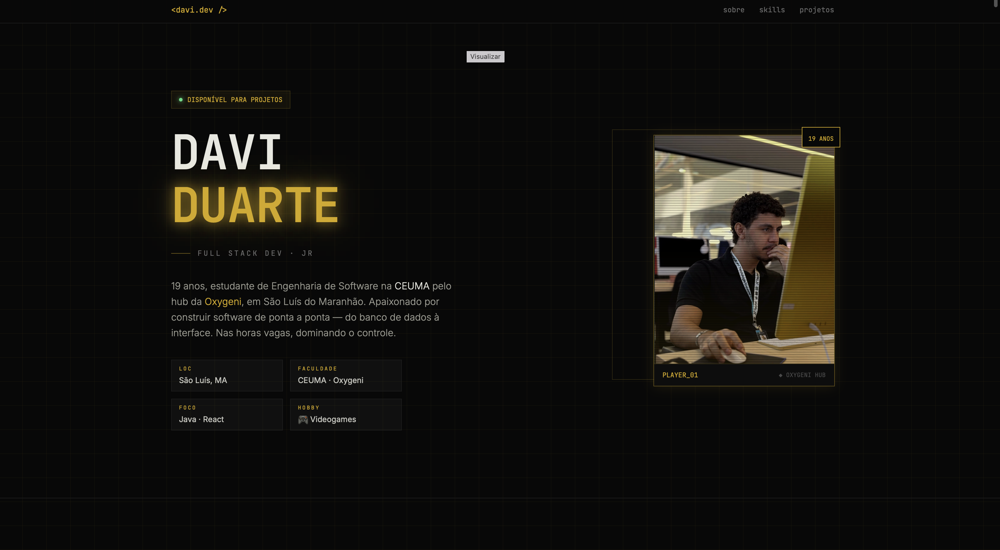
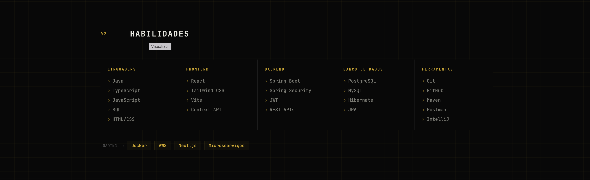
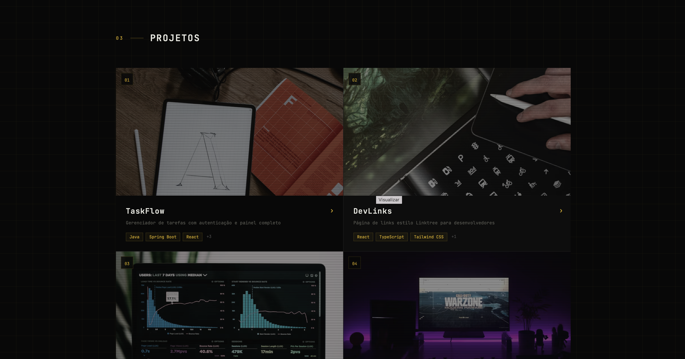
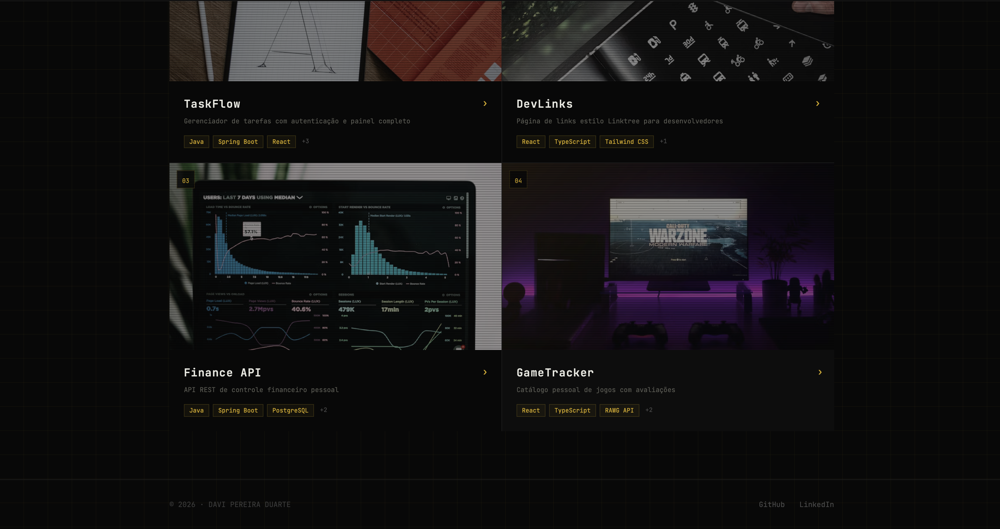
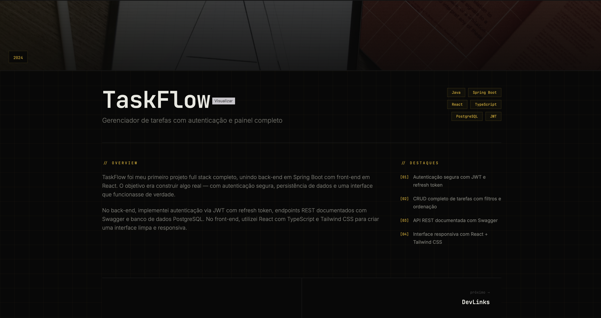

# Portfólio Pessoal · Davi Duarte

Portfólio pessoal de **Davi Pereira Duarte** — estudante de Engenharia de
Software na CEUMA pelo hub da Oxygeni, em São Luís do Maranhão.

O projeto nasceu como atividade acadêmica prototipada no **Figma Make** e está
sendo implementado como um site real em **React + TypeScript + Tailwind CSS**,
dentro de [`site/`](./site).

- 🎨 Protótipo no Figma: [Personal Portfolio Website](https://www.figma.com/make/ryhzQsRw6XYg4Q65RBQqRM/Personal-Portfolio-Website)
- 💻 Código do site: [`site/`](./site) · [como rodar](./site/README.md)

---

## Estrutura do portfólio

O portfólio é dividido em quatro seções principais, mais uma página de detalhe
por projeto:

| # | Seção | Conteúdo |
|---|-------|----------|
| 01 | Sobre | Apresentação, trajetória e áreas de interesse |
| 02 | Habilidades | Stack técnica por categoria, ligada aos projetos onde foi usada |
| 03 | Projetos | Grid com os quatro projetos desenvolvidos |
| 04 | Contato | E-mail, GitHub, LinkedIn e currículo |

---

## Telas

### 01 · Home

### 02 · Habilidades

### 03 · Projetos

### Páginas de detalhe

| Projeto | Descrição | Tela |
|---------|-----------|------|
| **TaskFlow** | Gerenciador de tarefas com autenticação e painel completo | [ver](docs/telas/05-taskflow.png) |
| **DevLinks** | Página de links estilo Linktree para desenvolvedores | [ver](docs/telas/06-devlinks.png) |
| **Finance API** | API REST de controle financeiro pessoal | [ver](docs/telas/07-finance-api.png) |
| **GameTracker** | Catálogo pessoal de jogos com avaliações | [ver](docs/telas/08-gametracker.png) |

---

## Stack

- **Protótipo:** Figma Make
- **Implementação:** React 19 · TypeScript · Tailwind CSS 4 · Vite · React Router

---

## Contato

- E-mail: davipduartee@gmail.com
- GitHub: [@davipduartee](https://github.com/davipduartee)
